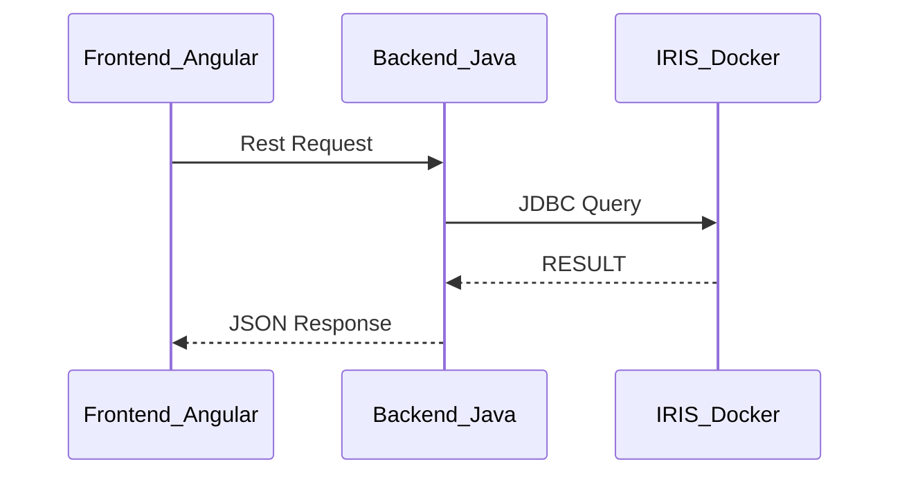

## Projeto Demonstração
No diretório `Labs/Starter` foi disponibilizado o projeto base com implementação de um CRUD utlizando a stack:
- [Angular](../Labs/Starter/Frontend-Angular/README.md)
- [Java](../Labs/Starter/Backend-Java/README.md)
- [IRIS](../Labs/Starter/InterSystems-IRIS/README.md)

